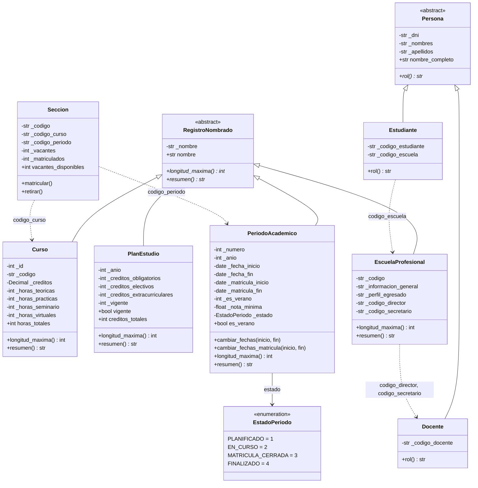

# Diagrama de clases

Triángulo hueco: herencia. Línea punteada: referencia por código (no por objeto). Los miembros con `*` son abstractos.

```mermaid
classDiagram
    class RegistroNombrado {
        <<abstract>>
        -str _nombre
        +str nombre
        +longitud_maxima()* int
        +resumen()* str
    }
    class Curso {
        -int _id
        -str _codigo
        -Decimal _creditos
        -int _horas_teoricas
        -int _horas_practicas
        -int _horas_seminario
        -int _horas_virtuales
        +int horas_totales
        +longitud_maxima() int
        +resumen() str
    }
    class PlanEstudio {
        -int _anio
        -int _creditos_obligatorios
        -int _creditos_electivos
        -int _creditos_extracurriculares
        -int _vigente
        +bool vigente
        +int creditos_totales
        +longitud_maxima() int
        +resumen() str
    }
    class EscuelaProfesional {
        -str _codigo
        -str _informacion_general
        -str _perfil_egresado
        -str _codigo_director
        -str _codigo_secretario
        +longitud_maxima() int
        +resumen() str
    }
    class PeriodoAcademico {
        -int _numero
        -int _anio
        -date _fecha_inicio
        -date _fecha_fin
        -date _matricula_inicio
        -date _matricula_fin
        -int _es_verano
        -float _nota_minima
        -EstadoPeriodo _estado
        +bool es_verano
        +cambiar_fechas(inicio, fin)
        +cambiar_fechas_matricula(inicio, fin)
        +longitud_maxima() int
        +resumen() str
    }
    class EstadoPeriodo {
        <<enumeration>>
        PLANIFICADO = 1
        EN_CURSO = 2
        MATRICULA_CERRADA = 3
        FINALIZADO = 4
    }
    class Seccion {
        -str _codigo
        -str _codigo_curso
        -str _codigo_periodo
        -int _vacantes
        -int _matriculados
        +int vacantes_disponibles
        +matricular()
        +retirar()
    }
    class Persona {
        <<abstract>>
        -str _dni
        -str _nombres
        -str _apellidos
        +str nombre_completo
        +rol()* str
    }
    class Estudiante {
        -str _codigo_estudiante
        -str _codigo_escuela
        +rol() str
    }
    class Docente {
        -str _codigo_docente
        +rol() str
    }

    RegistroNombrado <|-- Curso
    RegistroNombrado <|-- PlanEstudio
    RegistroNombrado <|-- EscuelaProfesional
    RegistroNombrado <|-- PeriodoAcademico
    Persona <|-- Estudiante
    Persona <|-- Docente
    PeriodoAcademico --> EstadoPeriodo : estado
    Seccion ..> Curso : codigo_curso
    Seccion ..> PeriodoAcademico : codigo_periodo
    Estudiante ..> EscuelaProfesional : codigo_escuela
    EscuelaProfesional ..> Docente : codigo_director, codigo_secretario
```
